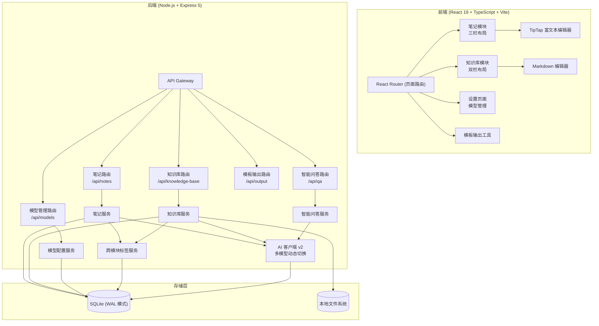

# AI Notes & Knowledge Base

Feature Name: ai-notes-knowledge-base
Updated: 2026-06-27

## Description

在现有知识助手项目基础上，重构为 AI 笔记（OneNote 风格层级管理 + 富文本编辑）和知识库（Windows 资源管理器风格文件管理）两大模块。现有知识片段功能拆分融入：文本保存融入笔记、文件上传融入知识库、标签跨模块共享、模板输出独立保留。同时升级大模型管理能力，支持按类别（问答/向量/重排序）配置和切换 OpenAI 兼容模型。

技术要点：
- 前端从单页面升级为多页面路由（react-router-dom）
- 新增 10 张数据库表：笔记本、笔记、笔记页、笔记页版本、知识库文件夹、知识库文件、知识库文件向量嵌入、AI 模型配置、笔记-知识库引用关联、多态标签关联
- AIClient 从硬编码单模型重构为多模型动态切换
- 引入 TipTap 富文本编辑器（基于 ProseMirror）
- 标签系统扩展为跨模块支持（笔记树 + 文件树）
- 知识库文件格式扩展为 .md + .docx + .pdf + 图片

## Architecture



### 页面路由设计

| 路径 | 页面 | 说明 |
|------|------|------|
| `/notes` | 笔记模块 | 双栏布局：笔记树（笔记本 > 笔记 > 笔记页层级树）/ 笔记页编辑器（首页为笔记页） |
| `/knowledge-base` | 知识库模块 | 双栏布局：文件夹列表 / 文件列表及预览 |
| `/output` | 模板输出 | 从笔记页和知识库文件中选择内容，按模板整理输出 |
| `/settings/models` | 模型设置 | 按类别分组的模型配置管理 |
| `/qa` | 智能问答 | 基于笔记和知识库内容的 AI 问答 |

## Components and Interfaces

### 1. 前端组件树

```
App.tsx (BrowserRouter)
├── Layout.tsx (侧边导航 + 内容区)
│   ├── Sidebar.tsx (导航菜单：笔记/知识库/输出/问答/设置)
│   └── <Outlet />
├── Pages/
│   ├── NotesPage.tsx (默认首页)
│   │   ├── NoteTree.tsx (左侧栏 - 笔记树：笔记本 > 笔记 > 笔记页层级树形结构)
│   │   └── NotePageEditor.tsx (右侧栏 - 笔记页编辑器)
│   │       └── TipTapEditor.tsx (富文本编辑器封装)
│   ├── KnowledgeBasePage.tsx
│   │   ├── FolderList.tsx (左侧栏 - 文件夹列表)
│   │   └── FilePanel.tsx (右侧栏)
│   │       ├── FileList.tsx (文件列表)
│   │       └── FilePreview.tsx (Markdown/Word/PDF 渲染)
│   ├── OutputPage.tsx (模板输出 - 现有 OutputPanel 功能迁移)
│   ├── QAPage.tsx
│   │   ├── QAInput.tsx (问题输入框)
│   │   └── QAAnswer.tsx (回答展示 + 引用来源)
│   └── SettingsPage.tsx
│       └── ModelManager.tsx
│           ├── ModelCategoryTabs.tsx (按类别切换)
│           └── ModelConfigForm.tsx (添加/编辑模型)
└── Components/ (共享组件)
    ├── GlobalSearch.tsx (全局搜索 - 覆盖笔记+知识库)
    └── TagManager.tsx (跨模块标签管理)
```

#### NoteTree 组件规格

NoteTree 是一个树形导航组件，在左侧面板中一次性展示笔记本 > 笔记 > 笔记页的完整层级结构。

**视觉层级**：
- 笔记本节点：一级节点，粗体，带笔记本图标，点击展开/折叠
- 笔记节点：二级节点，普通字体，带笔记图标，缩进 12px，点击展开/折叠
- 笔记页节点：叶子节点，浅色字体，带页面图标，缩进 24px，点击打开编辑器

**交互行为**：
- 展开/折叠：点击节点左侧的箭头图标切换展开状态
- 选中：点击笔记页节点，高亮并加载内容到右侧编辑器
- 右键菜单：节点类型决定菜单项
  - 笔记本：新建笔记、重命名、删除
  - 笔记：新建笔记页、重命名、删除
  - 笔记页：重命名、删除、导出到知识库
- 拖拽排序：同级节点可拖拽重排，笔记页可拖到不同笔记下
- 内联重命名：双击节点名称或右键 → 重命名，原地编辑

**数据加载策略**：
- 初始加载：只加载笔记本列表
- 懒加载：展开笔记本时才请求 `GET /api/notes/notebooks/:id/notes`
- 懒加载：展开笔记时才请求 `GET /api/notes/notes/:id/pages`

**状态管理**：
```
NoteTreeState {
  expandedIds: Set<string>        // "nb_1", "note_5"
  selectedPageId: number | null
  editNodeId: string | null       // 正在内联编辑的节点
  dragState: { ... } | null
}
```

### 2. 后端服务接口

#### 2.1 笔记模块 API

| 方法 | 路径 | 说明 |
|------|------|------|
| `GET` | `/api/notes/tree` | 获取完整笔记树（笔记本 + 笔记 + 笔记页的嵌套 JSON，用于树形导航） |
| `GET` | `/api/notes/notebooks` | 获取笔记本列表（按排序字段） |
| `POST` | `/api/notes/notebooks` | 创建笔记本 |
| `PUT` | `/api/notes/notebooks/:id` | 更新笔记本（重命名/排序） |
| `DELETE` | `/api/notes/notebooks/:id` | 删除笔记本（级联删除笔记+笔记页） |
| `GET` | `/api/notes/notebooks/:notebookId/notes` | 获取笔记本下的笔记列表 |
| `POST` | `/api/notes/notebooks/:notebookId/notes` | 在笔记本下创建笔记 |
| `PUT` | `/api/notes/notes/:id` | 更新笔记（重命名/排序/移动） |
| `DELETE` | `/api/notes/notes/:id` | 删除笔记（级联删除笔记页） |
| `GET` | `/api/notes/notes/:noteId/pages` | 获取笔记下的笔记页列表 |
| `POST` | `/api/notes/notes/:noteId/pages` | 创建笔记页 |
| `GET` | `/api/notes/pages/:id` | 获取笔记页内容 |
| `PUT` | `/api/notes/pages/:id` | 更新笔记页内容（触发自动保存） |
| `DELETE` | `/api/notes/pages/:id` | 删除笔记页 |
| `GET` | `/api/notes/pages/:id/versions` | 获取笔记页历史版本列表（最近 10 个） |
| `POST` | `/api/notes/pages/:id/restore/:versionId` | 回退到指定历史版本 |
| `POST` | `/api/notes/pages/:id/link-file` | 建立笔记页到知识库文件的引用关联 |
| `POST` | `/api/notes/pages/:id/export-to-kb` | 将笔记页导出为知识库 .md 文件 |

`GET /api/notes/tree` 返回结构：
```json
[
  {
    "id": 1,
    "name": "工作笔记",
    "type": "notebook",
    "children": [
      {
        "id": 10,
        "name": "项目计划",
        "type": "note",
        "children": [
          { "id": 100, "name": "需求梳理", "type": "page" },
          { "id": 101, "name": "技术方案", "type": "page" }
        ]
      }
    ]
  }
]
```

#### 2.2 知识库模块 API

| 方法 | 路径 | 说明 |
|------|------|------|
| `GET` | `/api/knowledge-base/folders` | 获取文件夹列表 |
| `POST` | `/api/knowledge-base/folders` | 创建文件夹 |
| `PUT` | `/api/knowledge-base/folders/:id` | 更新文件夹（重命名） |
| `DELETE` | `/api/knowledge-base/folders/:id` | 删除文件夹（级联删除文件） |
| `GET` | `/api/knowledge-base/folders/:folderId/files` | 获取文件夹下的文件列表 |
| `POST` | `/api/knowledge-base/folders/:folderId/files` | 上传文件（multipart, .md/.docx/.pdf/.jpg/.png/.gif/.webp） |
| `GET` | `/api/knowledge-base/files/:id` | 获取文件详情 |
| `GET` | `/api/knowledge-base/files/:id/content` | 获取文件解析后的内容（渲染用） |
| `PUT` | `/api/knowledge-base/files/:id` | 更新文件（重命名/移动） |
| `DELETE` | `/api/knowledge-base/files/:id` | 删除文件 |
| `GET` | `/api/knowledge-base/files/:id/refs` | 获取该文件被哪些笔记页引用 |

#### 2.3 AI 模型管理 API

| 方法 | 路径 | 说明 |
|------|------|------|
| `GET` | `/api/models` | 获取模型配置列表（按类别分组） |
| `POST` | `/api/models` | 添加模型配置 |
| `PUT` | `/api/models/:id` | 更新模型配置 |
| `DELETE` | `/api/models/:id` | 删除模型配置 |
| `POST` | `/api/models/:id/test` | 测试模型连通性 |
| `PUT` | `/api/models/:id/default` | 设为该类别的默认模型 |

#### 2.4 智能问答 API

| 方法 | 路径 | 说明 |
|------|------|------|
| `POST` | `/api/qa/ask` | 提交问题，返回检索增强生成的回答 |

### 3. AI 客户端重构 (AIClient v2)

现有 `AIClient.ts` 中硬编码了 `gpt-3.5-turbo` 和 `text-embedding-ada-002`。重构为：

```typescript
// AIClient v2 核心变更
class AIClient {
  // 从数据库动态获取模型配置
  private async getModelForTask(category: ModelCategory): Promise<ModelConfig>

  // 按任务类型选择对应类别的默认模型
  async chatComplete(messages: ChatMessage[]): Promise<string>
  // 从 "问答模型" 类别取默认模型，构造 OpenAI client，调用 /chat/completions

  async generateEmbedding(text: string): Promise<number[]>
  // 从 "向量模型" 类别取默认模型，调用 /embeddings

  async rerank(query: string, documents: string[]): Promise<ScoredDoc[]>
  // 从 "重排序模型" 类别取默认模型，调用 /rerank (或兼容接口)
  // 若未配置重排序模型，跳过精排步骤，直接返回原始排序结果
}
```

每个方法按需创建临时 OpenAI client 实例（传入对应模型的 `baseURL` + `apiKey`），不缓存 client，确保模型配置变更即时生效。

### 4. 前端富文本编辑器选型

选用 **TipTap**（基于 ProseMirror），原因：
- 开源免费，React 一等支持
- 文档丰富，插件生态成熟（表格、代码块、图片、Markdown 快捷键）
- 支持自定义扩展（知识库文件引用嵌入、AI 辅助按钮）
- 内容以 HTML/JSON 格式存储，与后端兼容性好

### 5. 全局搜索策略

全局搜索（需求第 10 条）需要同时覆盖笔记页和知识库文件两种来源：

1. **笔记页搜索**：对 `note_pages.plain_text` 和 `note_pages.title` 做关键词 LIKE 匹配（速度快，无需向量），同时对标签名匹配
2. **知识库文件搜索**：通过向量模型生成查询向量，在 `knowledge_file_embeddings` 中做余弦相似度匹配，获取结果后读取 `knowledge_files` 详情
3. **结果合并**：按来源类型分组（笔记 / 知识库），每组内按相关性排序后合并返回
4. **标签作为命中属性**：搜索结果中，若实体有关联标签，标签名也作为搜索命中维度展示

## Data Models

### 新增数据库表

#### 表 1: notebooks (笔记本)

```sql
CREATE TABLE IF NOT EXISTS notebooks (
    id INTEGER PRIMARY KEY AUTOINCREMENT,
    user_id INTEGER NOT NULL DEFAULT 1,
    name VARCHAR(100) NOT NULL,
    sort_order INTEGER NOT NULL DEFAULT 0,
    created_at DATETIME DEFAULT CURRENT_TIMESTAMP,
    updated_at DATETIME DEFAULT CURRENT_TIMESTAMP
);
CREATE INDEX idx_notebooks_user ON notebooks(user_id);
```

#### 表 2: notes (笔记)

```sql
CREATE TABLE IF NOT EXISTS notes (
    id INTEGER PRIMARY KEY AUTOINCREMENT,
    notebook_id INTEGER NOT NULL,
    user_id INTEGER NOT NULL DEFAULT 1,
    name VARCHAR(200) NOT NULL,
    sort_order INTEGER NOT NULL DEFAULT 0,
    created_at DATETIME DEFAULT CURRENT_TIMESTAMP,
    updated_at DATETIME DEFAULT CURRENT_TIMESTAMP,
    FOREIGN KEY (notebook_id) REFERENCES notebooks(id) ON DELETE CASCADE
);
CREATE INDEX idx_notes_notebook ON notes(notebook_id);
```

#### 表 3: note_pages (笔记页)

```sql
CREATE TABLE IF NOT EXISTS note_pages (
    id INTEGER PRIMARY KEY AUTOINCREMENT,
    note_id INTEGER NOT NULL,
    user_id INTEGER NOT NULL DEFAULT 1,
    title VARCHAR(300),
    content TEXT NOT NULL DEFAULT '',       -- HTML 富文本内容
    plain_text TEXT DEFAULT '',             -- 纯文本（用于搜索索引）
    sort_order INTEGER NOT NULL DEFAULT 0,
    created_at DATETIME DEFAULT CURRENT_TIMESTAMP,
    updated_at DATETIME DEFAULT CURRENT_TIMESTAMP,
    FOREIGN KEY (note_id) REFERENCES notes(id) ON DELETE CASCADE
);
CREATE INDEX idx_note_pages_note ON note_pages(note_id);
```

#### 表 4: note_page_versions (笔记页历史版本)

```sql
CREATE TABLE IF NOT EXISTS note_page_versions (
    id INTEGER PRIMARY KEY AUTOINCREMENT,
    page_id INTEGER NOT NULL,
    content TEXT NOT NULL,                  -- 版本快照内容
    created_at DATETIME DEFAULT CURRENT_TIMESTAMP,
    FOREIGN KEY (page_id) REFERENCES note_pages(id) ON DELETE CASCADE
);
CREATE INDEX idx_versions_page ON note_page_versions(page_id);
```

版本保留策略：每个笔记页最多保留 10 个版本，新建版本时删除最旧的超出版本。

#### 表 5: knowledge_folders (知识库文件夹)

```sql
CREATE TABLE IF NOT EXISTS knowledge_folders (
    id INTEGER PRIMARY KEY AUTOINCREMENT,
    user_id INTEGER NOT NULL DEFAULT 1,
    name VARCHAR(200) NOT NULL,
    sort_order INTEGER NOT NULL DEFAULT 0,
    created_at DATETIME DEFAULT CURRENT_TIMESTAMP,
    updated_at DATETIME DEFAULT CURRENT_TIMESTAMP
);
CREATE INDEX idx_folders_user ON knowledge_folders(user_id);
```

#### 表 6: knowledge_files (知识库文件)

```sql
CREATE TABLE IF NOT EXISTS knowledge_files (
    id INTEGER PRIMARY KEY AUTOINCREMENT,
    folder_id INTEGER NOT NULL,
    user_id INTEGER NOT NULL DEFAULT 1,
    name VARCHAR(300) NOT NULL,
    file_type VARCHAR(10) NOT NULL,         -- 'md' | 'docx' | 'pdf' | 'image'
    file_path VARCHAR(500),                 -- 原始文件存储路径
    content_markdown TEXT,                  -- 解析后的 Markdown 正文（用于渲染和搜索）
    content_structured TEXT,                -- 解析后的结构化数据 JSON（保留标题/表格/图片等结构）
    summary TEXT,                           -- AI 生成的摘要
    created_at DATETIME DEFAULT CURRENT_TIMESTAMP,
    updated_at DATETIME DEFAULT CURRENT_TIMESTAMP,
    FOREIGN KEY (folder_id) REFERENCES knowledge_folders(id) ON DELETE CASCADE
);
CREATE INDEX idx_files_folder ON knowledge_files(folder_id);
CREATE INDEX idx_files_type ON knowledge_files(file_type);
```

#### 表 7: knowledge_file_embeddings (知识库文件向量嵌入)

```sql
CREATE TABLE IF NOT EXISTS knowledge_file_embeddings (
    id INTEGER PRIMARY KEY AUTOINCREMENT,
    file_id INTEGER NOT NULL,
    embedding TEXT NOT NULL,                -- 向量 JSON 数组
    model VARCHAR(50),
    created_at DATETIME DEFAULT CURRENT_TIMESTAMP,
    FOREIGN KEY (file_id) REFERENCES knowledge_files(id) ON DELETE CASCADE
);
CREATE INDEX idx_kfe_file ON knowledge_file_embeddings(file_id);
```

#### 表 8: note_page_refs (笔记页-知识库文件引用关联)

```sql
CREATE TABLE IF NOT EXISTS note_page_refs (
    id INTEGER PRIMARY KEY AUTOINCREMENT,
    page_id INTEGER NOT NULL,
    file_id INTEGER NOT NULL,
    ref_type VARCHAR(10) NOT NULL,          -- 'link' | 'embed'
    created_at DATETIME DEFAULT CURRENT_TIMESTAMP,
    FOREIGN KEY (page_id) REFERENCES note_pages(id) ON DELETE CASCADE,
    FOREIGN KEY (file_id) REFERENCES knowledge_files(id) ON DELETE CASCADE,
    UNIQUE(page_id, file_id, ref_type)
);
```

#### 表 9: ai_model_configs (AI 模型配置)

```sql
CREATE TABLE IF NOT EXISTS ai_model_configs (
    id INTEGER PRIMARY KEY AUTOINCREMENT,
    user_id INTEGER NOT NULL DEFAULT 1,
    name VARCHAR(200) NOT NULL,             -- 用户自定义模型名称（如 "本地 Qwen 72B"）
    category VARCHAR(20) NOT NULL,          -- 预定义类别: 'chat'|'embedding'|'reranker'
    api_base_url VARCHAR(500) NOT NULL,     -- API 地址 (如 http://192.168.1.100:8080/v1)
    api_key VARCHAR(500) NOT NULL,          -- API Key
    model_identifier VARCHAR(200) NOT NULL, -- 模型标识符 (如 qwen2.5-72b-instruct)
    is_default BOOLEAN DEFAULT FALSE,       -- 是否该类别的默认模型
    is_active BOOLEAN DEFAULT TRUE,         -- 是否启用
    last_test_status VARCHAR(20),           -- 最近测试结果: 'ok'|'fail'|'timeout'
    last_test_at DATETIME,
    created_at DATETIME DEFAULT CURRENT_TIMESTAMP,
    updated_at DATETIME DEFAULT CURRENT_TIMESTAMP
);
CREATE INDEX idx_model_configs_category ON ai_model_configs(user_id, category);
```

预定义类别常量：
| 类别键 | 显示名称 | 用于场景 |
|--------|----------|----------|
| `chat` | 问答模型 | 笔记辅助（续写/摘要/润色/翻译）、智能问答、标签生成 |
| `embedding` | 向量模型 | 知识库文件向量化、语义搜索、关联推荐 |
| `reranker` | 重排序模型 | 语义搜索结果精排（可选，无此模型时跳过重排步骤） |

### 现有表变更

现有 `knowledge` 表及其关联表（`tags`、`knowledge_tags`、`templates`、`output_history`、`document_structures`、`embeddings`）保留，但前端入口移除，仅作为数据迁移的存量数据保留。新增知识内容通过笔记模块（文本）和知识库模块（文件）录入。

现有 `tags` 表扩展为跨模块标签系统，通过多态关联表支持笔记树和文件树：

#### 表 10: taggables (多态标签关联)

```sql
CREATE TABLE IF NOT EXISTS taggables (
    id INTEGER PRIMARY KEY AUTOINCREMENT,
    tag_id INTEGER NOT NULL,
    entity_type VARCHAR(20) NOT NULL,       -- 'notebook'|'note'|'note_page'|'folder'|'file'
    entity_id INTEGER NOT NULL,
    created_at DATETIME DEFAULT CURRENT_TIMESTAMP,
    FOREIGN KEY (tag_id) REFERENCES tags(id) ON DELETE CASCADE,
    UNIQUE(tag_id, entity_type, entity_id)
);
CREATE INDEX idx_taggables_entity ON taggables(entity_type, entity_id);
```

此表替代现有的 `knowledge_tags` 表（`knowledge_tags` 保留用于存量数据，不再用于新增操作）。所有新增的笔记树节点和知识库节点均通过 `taggables` 关联标签。

## Correctness Properties

1. **级联删除一致性**：删除笔记本时自动删除下属笔记、笔记页、笔记页版本、引用关联、标签关联；删除文件夹时自动删除下属文件和向量嵌入、标签关联
2. **历史版本上限**：插入新版本后，若该笔记页版本数超过 10，按 `created_at` 升序删除最旧版本
3. **默认模型唯一性**：每个类别（category）最多一个默认模型，设置新默认时自动取消同类别的旧默认
4. **富文本自动保存**：前端 30 秒超时 + 失焦触发 PUT 请求更新笔记页内容，后端同步更新 `plain_text`（HTML 标签剥离）用于搜索索引
5. **文件解析事务性**：上传文件时，解析、存储文件记录、AI 摘要/标签生成在同一请求中完成；解析失败时回滚文件记录
6. **向量检索去重**：全局搜索时，笔记页搜索（关键词匹配 plain_text）和知识库文件搜索（向量相似度）合并结果，按来源类型分组
7. **标签跨模块一致性**：标签名称全局唯一（复用现有 `tags.name UNIQUE` 约束），删除标签时 `taggables` 中关联记录自动级联删除

## Error Handling

| 场景 | 处理方式 |
|------|----------|
| 富文本编辑器崩溃 | TipTap 内置异常边界，自动恢复到上次保存内容；提供"重置编辑器"按钮 |
| 自动保存失败 | 前端在前 3 次失败时静默重试（间隔 5 秒），第 4 次显示"保存失败，请手动保存"提示 |
| AI 模型配置无效 | 保存前发送测试请求验证；测试超时 10 秒，失败时展示详细错误（连接拒绝/超时/403/401）并阻止设默认 |
| AI 处理超时 | 30 秒超时，前端显示"处理超时"并提供重试按钮；用户可切换到备选模型 |
| 文件解析失败 | 保留原始文件供下载，`content_markdown` 置空，前端显示"解析失败，可下载原文件查看" |
| 向量嵌入生成失败 | 文件正常保存，向量嵌入留空；搜索时该文件不参与语义搜索，仅参与关键词搜索 |
| 知识库文件删除冲突 | 若被笔记页引用，弹出提示"该文件被 X 个笔记页引用，删除后引用将失效"，确认后执行级联清理 `note_page_refs` 和 `taggables` |
| 并发编辑冲突 | 后端在更新笔记页时检查 `updated_at` 字段，若与请求中携带的不一致，返回 409 并附上最新内容供用户合并 |
| 标签重名 | 标签名称全局唯一（数据库 UNIQUE 约束），创建重名标签时返回 409 并提示"标签已存在" |

## Test Strategy

### 单元测试
- 笔记 CRUD 服务：验证创建/更新/删除/移动/排序逻辑
- 知识库 CRUD 服务：验证文件夹和文件的层级管理，验证多格式文件解析路由
- 模型配置服务：验证默认模型切换逻辑
- AIClient v2：Mock 模型配置，验证动态 client 创建和错误处理
- 富文本编辑器：验证 HTML 到 plain_text 的剥离逻辑
- 跨模块标签服务：验证多态关联的创建和查询

### 集成测试
- 笔记页自动保存 → 版本快照 → 回退完整流程
- 知识库文件上传（.md/.docx/.pdf/图片） → 解析 → 向量化 → 搜索流程
- 笔记页引用知识库文件 → 导出 .md → 文件出现在知识库
- 模型配置 → 切换默认模型 → AI 辅助调用新模型
- 全局搜索：同时返回笔记页和知识库文件结果，标签作为搜索命中属性
- 跨模块标签：给笔记本/笔记页/文件夹/文件分别打标签 → 按标签搜索 → 返回所有关联实体

### 端到端测试
- 用户创建笔记本 → 笔记 → 笔记页 → 编辑富文本 → 自动保存 → 查看历史版本
- 用户上传 .md 文件到知识库 → 自动向量化 → 语义搜索找到该文件
- 用户在笔记页中拖入知识库文件 → 生成引用链接 → 点击跳转
- 用户在问答页面提问 → 系统检索笔记+知识库 → 标注来源生成回答

## Implementation Phases

### Phase 1: 数据层 + 模型管理
- [ ] 数据库迁移：新增 10 张表（含 `taggables` 多态标签关联表），保留现有表用于存量数据
- [ ] 模型配置 CRUD API + 连通性测试
- [ ] AIClient v2 重构（多模型动态切换）

### Phase 2: 知识库模块
- [ ] 文件夹 CRUD API
- [ ] 文件上传/解析/预览 API（复用现有 PdfParser/WordParser/ImageParser）
- [ ] 文件向量化和语义搜索（复用现有 SearchService 模式）
- [ ] 前端知识库页面（双栏布局 + Markdown 编辑器 + 格式预览）

### Phase 3: 笔记模块
- [ ] 笔记本/笔记/笔记页 CRUD API
- [ ] 笔记页历史版本管理
- [ ] TipTap 富文本编辑器集成
- [ ] 前端笔记页面（笔记树 + 笔记页编辑器的双栏布局 + 拖拽排序 + 自动保存）

### Phase 4: 标签 + 模块互通 + 智能问答
- [ ] 跨模块标签服务（`TagService` + 多态关联 `taggables`）
- [ ] 笔记页-知识库文件引用关联 API
- [ ] 笔记页导出为知识库 .md 文件
- [ ] 智能问答 API（跨模块检索 + RAG 回答）
- [ ] 前端问答页面 + 全局搜索
- [ ] 前端标签管理组件（跨模块标签展示/筛选）

### Phase 5: 模板输出独立保留
- [ ] 现有 `OutputPanel` / `OutputService` 迁移为独立 `/output` 页面
- [ ] 支持从笔记页和知识库文件中选择内容进行模板整理

## References

[^1]: (TipTap) - 富文本编辑器框架 https://tiptap.dev/
[^2]: (react-router-dom) - React 路由库（已安装但未使用） `/workspace/frontend/package.json#L16`
[^3]: (ProseMirror) - TipTap 底层编辑器引擎 https://prosemirror.net/
[^4]: (现有 AIClient) - 当前 AI 客户端实现 `/workspace/backend/src/services/AIClient.ts`
[^5]: (现有数据库) - 数据库初始化脚本 `/workspace/backend/src/utils/database.ts`
[^6]: (现有前端入口) - 当前 App.tsx `/workspace/frontend/src/App.tsx`
