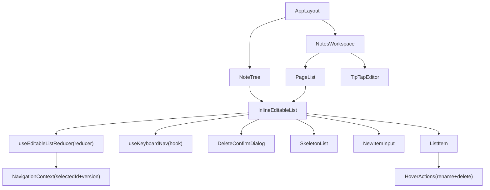

# NoteTree & PageList 交互重设计 — 技术设计文档

Feature Name: note-tree-pagelist-redesign
Updated: 2026-06-28

## 描述

将 NoteTree（笔记本列表）和 PageList（笔记页列表）重构为统一交互模式的列表组件，使用 `useReducer` 管理所有交互状态，提取共享的 `InlineEditableList` 组件和 `useEditableListReducer` hook，对标 VS Code / Notion / Linear 的交互规范。

## 架构



**核心思路**：NoteTree 和 PageList 共享同一套交互逻辑（悬停 → 操作按钮淡入、单击 → 选中/重命名、内联新建、删除确认、键盘导航），通过 `InlineEditableList` 组件 + `useEditableListReducer` hook 统一实现，避免两套代码各自修补。

## 组件与接口

### 1. `useEditableListReducer<T>` — 共享状态管理 hook

**文件**: `frontend/src/hooks/useEditableListReducer.ts`

```
输入:
  items: T[]
  loading: boolean
  selectedId: number | null (外部选中ID，用于清除不匹配的编辑态)

输出:
  state: { editingId, editValue, adding, newValue, newNameError, hoveredId,
           focusedIndex, deleteConfirm... }
  dispatch: (action) => void
  handlers: { startEdit, commitEdit, cancelEdit, startAdd, commitAdd,
              cancelAdd, showDeleteConfirm, hideDeleteConfirm, handleKeyDown, ... }
```

**Action 清单**（覆盖已有 6 个 useState 的全部状态流转）：

| Action | 触发时机 | 效果 |
|--------|---------|------|
| `START_EDIT` | 单击已选中项 / 双击 | editingId = id, editValue = name |
| `SET_EDIT_VALUE` | 输入框 onChange | editValue = value |
| `COMMIT_EDIT` | Enter / blur | 回调 onRename(id, editValue)，乐观更新 items |
| `CANCEL_EDIT` | Escape / selectedId 变化 | editingId = null |
| `START_ADD` | 点击新建按钮 | adding = true, newValue = '' |
| `SET_NEW_VALUE` | 输入框 onChange | newValue = value |
| `SET_NEW_ERROR` | 名称验证失败 | newNameError = message |
| `COMMIT_ADD` | Enter + 验证通过 | 回调 onCreate(newValue)，插入 items 顶部 |
| `CANCEL_ADD` | Escape / blur | adding = false, newValue = '' |
| `REMOVE` | 删除确认后 | 过滤 items，回调 onDelete(id) |
| `SET_HOVER` | mouseEnter/mouseLeave | hoveredId = id |
| `SET_FOCUS` | 键盘 ↑↓ | focusedIndex 变化 |
| `SHOW_DELETE_CONFIRM` | 删除按钮点击 | deleteConfirmId = id |
| `HIDE_DELETE_CONFIRM` | 取消 / 确认后 | deleteConfirmId = null |
| `CLEAR_EDITING_IF_NOT` | selectedId 外部变化 | 若 editingId !== selectedId 则取消编辑 |

**乐观更新策略**：
- 重命名: `dispatch({ type: 'COMMIT_EDIT' })` → 立即 `UPDATE_ITEM` → 异步 `onRename(id, name)` → 失败则回滚
- 创建: `dispatch({ type: 'COMMIT_ADD' })` → 立即 `ADD_ITEM` → 异步 `onCreate(name)` → 失败则回滚
- 删除: `dispatch({ type: 'COMMIT_DELETE' })` → 立即 `REMOVE_ITEM` → 异步 `onDelete(id)` → 失败则回滚 + toast

### 2. `InlineEditableList<T>` — 共享 UI 组件

**文件**: `frontend/src/components/notes/InlineEditableList.tsx`

```
Props:
  items: T[]
  loading: boolean
  selectedId: number | null
  getId: (item: T) => number
  getName: (item: T) => string
  getCount?: (item: T) => number | undefined
  renderIcon: (item: T) => ReactNode
  newItemPlaceholder: string
  emptyGuide: string
  onSelect: (id: number) => void
  onRename: (id: number, name: string) => Promise<boolean>
  onDelete: (id: number) => Promise<boolean>
  onCreate: (name: string) => Promise<T | null>
  validateName: (name: string, items: T[], editingId?: number) => string | null
```

**渲染结构**：

```
┌─ Header ─────────────────────────────────────┐
│ [Icon] 标题                        [+ 新建]  │
├─ Scrollable List ────────────────────────────┤
│                                               │
│  [loading? SkeletonList :                      │
│    adding? NewItemInput (顶部) : null]         │
│                                               │
│  items.map(item =>                             │
│    ListItem                                    │
│      ├─ Default: icon + name + count           │
│      │   + HoverActions (opacity 0→1)          │
│      ├─ Editing: inline input                  │
│      └─ Selected: highlight + primary color    │
│  )                                             │
│                                               │
│  [items.length===0 && !adding?                 │
│    EmptyState : null]                          │
└───────────────────────────────────────────────┘
```

### 3. `NoteTree` — 笔记本列表（适配层）

**文件**: `frontend/src/components/notes/NoteTree.tsx`（重写）

```typescript
export default function NoteTree() {
  const { selectedNoteId, notebooksVersion } = useNotesState();
  const { selectNote, deselectNote } = useNotesActions();
  const [items, setItems] = useState<Notebook[]>([]);
  const [loading, setLoading] = useState(true);

  // 加载数据
  useEffect(() => {
    setLoading(true);
    notesService.getNotebooks()
      .then(data => { setItems(data.reverse()); setLoading(false); })
      .catch(() => setLoading(false));
  }, [notebooksVersion]);

  return (
    <InlineEditableList<Notebook>
      items={items}
      loading={loading}
      selectedId={selectedNoteId}
      getId={n => n.id}
      getName={n => n.name}
      getCount={n => n.note_count}
      renderIcon={() => '📓'}
      newItemPlaceholder="笔记本名称"
      emptyGuide="点击 + 创建笔记本"
      onSelect={id => selectNote(id)}
      onRename={async (id, name) => {
        try {
          await notesService.updateNotebook(id, { name });
          return true;
        } catch { return false; }
      }}
      onDelete={async (id) => {
        try {
          await notesService.deleteNotebook(id);
          if (selectedNoteId === id) deselectNote();
          return true;
        } catch { return false; }
      }}
      onCreate={async (name) => {
        try {
          const nb = await notesService.createNotebook(name);
          return { ...nb, note_count: 0 };
        } catch { return null; }
      }}
      validateName={(name, items, editingId) => {
        if (!name.trim()) return '名称不能为空';
        if (items.some(n => n.name === name && n.id !== editingId))
          return '同名笔记本已存在';
        return null;
      }}
    />
  );
}
```

### 4. `PageList` — 笔记页列表（适配层，从 NotesWorkspace 中拆分）

**文件**: `frontend/src/components/notes/PageList.tsx`（新建）

```typescript
export default function PageList({
  pages, loadingPages,
  selectedNoteId, selectedPageId,
  onPageCreated, // ← 通知 NotesWorkspace 更新 pages 列表
}) {
  const { selectPage, refreshNotebooks } = useNotesActions();

  return (
    <InlineEditableList<PageWithNote>
      items={pages}
      loading={loadingPages}
      selectedId={selectedPageId}
      getId={p => p.id}
      getName={p => p.title}
      renderIcon={() => '📄'}
      newItemPlaceholder="笔记页标题"
      emptyGuide="点击 + 创建笔记页"
      onSelect={id => selectPage(id)}
      onRename={async (id, title) => {
        try {
          await notesService.updatePage(id, { title });
          return true;
        } catch { return false; }
      }}
      onDelete={async (id) => {
        try {
          await notesService.deletePage(id);
          if (selectedPageId === id) selectPage(null as any);
          refreshNotebooks();
          return true;
        } catch { return false; }
      }}
      onCreate={onPageCreated} // ← 由 NotesWorkspace 提供（含自动创建笔记逻辑）
      validateName={(name, items, editingId) => {
        if (!name.trim()) return '标题不能为空';
        // 仅检查同一 noteId 下的重名
        const editingItem = items.find(p => p.id === editingId);
        const noteId = editingItem?.noteId;
        if (items.some(p => p.title === name && p.noteId === noteId && p.id !== editingId))
          return '同名笔记页已存在';
        return null;
      }}
    />
  );
}
```

### 5. `DeleteConfirmDialog` — 自定义删除确认对话框

**文件**: `frontend/src/components/notes/DeleteConfirmDialog.tsx`（新建）

替代浏览器原生 `confirm()`，样式匹配组件体系：

```
┌──────────────────────────────────┐
│  确定删除 "XXX"？                │
│                                  │
│  [取消]              [删除]      │
└──────────────────────────────────┘
```

- 遮罩层: `var(--color-overlay)`，z-index: 100
- 对话框: `var(--color-bg-primary)`，圆角 `var(--radius-md)`，阴影
- 删除按钮: 红色文字警告
- Enter 键触发删除，Escape 键触发取消

### 6. `SkeletonList` — 骨架屏加载

**文件**: `frontend/src/components/notes/SkeletonList.tsx`（新建）

3 个灰色占位块，每块 16px 高，6px 圆角，带 1.5s 闪烁动画（`@keyframes shimmer`：从 `--color-bg-hover` 到 `--color-bg-secondary` 来回）。

### 7. `useKeyboardNav` — 键盘导航 hook

**文件**: `frontend/src/hooks/useKeyboardNav.ts`（新建）

```typescript
function useKeyboardNav(config: {
  itemCount: number;
  onSelectIndex: (index: number) => void;
  onRenameIndex: (index: number) => void;
  onDeleteIndex: (index: number) => void;
  onEscape: () => void;
  containerRef: RefObject<HTMLElement>;
})
```

- ↑↓: 移动 focusedIndex，循环边界
- Enter: onSelectIndex(focusedIndex)
- F2: onRenameIndex(focusedIndex)
- Delete: onDeleteIndex(focusedIndex)
- Escape: onEscape()
- container tabIndex={0}，onFocus 时设置 focusedIndex=0（如果 -1）

### 8. `HoverActions` — 悬停操作按钮组

**文件**: `frontend/src/components/notes/HoverActions.tsx`（新建）

```typescript
function HoverActions({
  visible,        // ← 由列表项 hover 状态控制
  onRename,
  onDelete,
  disabled,       // ← 编辑态时隐藏
}: { visible: boolean; onRename: () => void; onDelete: () => void; disabled: boolean })
```

```
┌─ HoverActions (opacity transition) ─┐
│  [✏️]  [🗑]  (2个图标按钮，4px 间距)  │
└─────────────────────────────────────┘
```

- 正常状态: `opacity: 0`, `pointer-events: none`
- 悬停/选中: `opacity: 1`, `pointer-events: auto`
- 编辑态: 强制 opacity: 0（通过 disabled prop）
- 过渡: `transition: opacity 0.1s ease`

## 数据模型

### useEditableListReducer 状态定义

```typescript
interface EditableListState<T> {
  items: T[];
  loading: boolean;
  editingId: number | null;
  editValue: string;
  adding: boolean;
  newValue: string;
  newNameError: string | null;
  hoveredId: number | null;
  focusedIndex: number;
  deleteConfirmId: number | null;
  deleteConfirmName: string;
}
```

### 现有类型（不变）

- `Notebook`: id, name, sort_order, note_count? — 来自 `types/notes.ts`
- `NotePage`: id, title, content, note_id — 来自 `types/notes.ts`
- `PageWithNote`: id, title, content, noteId, noteName — NotesWorkspace 内部接口

## 正确性不变量

1. **编辑态互斥**: 同一列表同一时刻只有一个项处于编辑态
2. **编辑+选中一致**: editingId 必须是 selectedId 的子集（否则自动清除）
3. **删除时取消选中**: 删除选中项时必须清除外部 selectedId
4. **数量同步**: 创建/删除笔记页后必须 +1 notebooksVersion
5. **乐观回滚**: rename/create/delete 先改 UI → API 失败 → 回滚 items
6. **新建无闪烁**: adding 输入框出现时，空状态引导立即隐藏

## 错误处理

| 场景 | 处理 |
|------|------|
| API 调用失败 | Toast 错误提示（保留已有机制），乐观更新回滚 |
| 网络离线 | API 调用直接失败，乐观更新回滚 |
| 名称验证失败 | 内联错误提示（红色文字，输入框下方），不提交 API |
| 并发编辑冲突 | 先到先得，后提交的可能被覆盖（不做冲突检测） |

## 文件变更清单

| 操作 | 文件 | 说明 |
|------|------|------|
| 新建 | `frontend/src/hooks/useEditableListReducer.ts` | 共享状态管理 reducer + hook |
| 新建 | `frontend/src/hooks/useKeyboardNav.ts` | 键盘导航 hook |
| 新建 | `frontend/src/components/notes/InlineEditableList.tsx` | 共享列表 UI 组件 |
| 新建 | `frontend/src/components/notes/DeleteConfirmDialog.tsx` | 自定义删除确认对话框 |
| 新建 | `frontend/src/components/notes/SkeletonList.tsx` | 骨架屏加载 |
| 新建 | `frontend/src/components/notes/HoverActions.tsx` | 悬停操作按钮组 |
| 新建 | `frontend/src/components/notes/NewItemInput.tsx` | 新建输入框（含错误提示） |
| 重写 | `frontend/src/components/notes/NoteTree.tsx` | 改为 InlineEditableList 适配层 |
| 新建 | `frontend/src/components/notes/PageList.tsx` | 从 NotesWorkspace 拆分，独立组件 |
| 修改 | `frontend/src/components/NotesWorkspace.tsx` | 引用 PageList 替代内联 page 列表 |
| 不变 | `frontend/src/contexts/NavigationContext.tsx` | 已有 DESELECT_NOTE + notebooksVersion |
| 不变 | `frontend/src/services/notesService.ts` | API 层已完备 |
| 不变 | `frontend/src/types/notes.ts` | 类型定义已完备 |

## 测试策略

1. **单元测试**: `useEditableListReducer` 每个 action 的状态转换
2. **组件测试**: `InlineEditableList` 的渲染、悬停、点击、编辑、删除流程
3. **集成测试**: NoteTree + PageList 联动的数量刷新
4. **E2E (可选)**: 完整用户流程（创建笔记本 → 创建页面 → 编辑 → 删除）

## 实施顺序

1. `useEditableListReducer` + `useKeyboardNav` — hook 基础层
2. `SkeletonList` + `DeleteConfirmDialog` + `HoverActions` + `NewItemInput` — 子组件层
3. `InlineEditableList` — 主组件层（集成子组件 + hook）
4. `NoteTree` 重写 — 适配层（验证笔记本列表）
5. `PageList` + NotesWorkspace 改造 — 适配层（验证页面列表 + 数量联动）
6. 构建 + 测试

## 参考

[^1]: VS Code — 文件浏览器单击/双击语义、F2 重命名、Delete 确认、键盘导航规范
[^2]: Notion — 侧边栏操作悬停淡入、内联编辑标题、Toast 撤销删除
[^3]: Linear — 分组标题大写淡化、悬停 opacity 过渡、骨架屏加载
