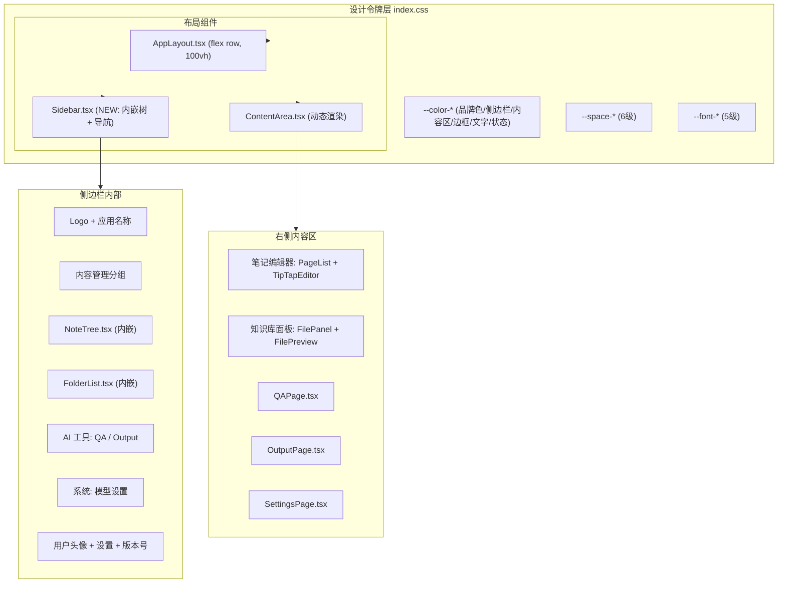

# UI Layout Optimization

Feature Name: ui-layout-optimization
Updated: 2026-06-28

## Description

对现有 AI 知识助手前端进行 UI 系统性优化：建立设计令牌体系（CSS 变量）、重构侧边栏为内嵌树形导航面板（笔记树 + 知识库文件夹树 + 功能链接）、实现右侧动态内容区、消除所有硬编码样式值。

核心策略：
- 保持行内样式 + CSS 变量方案
- 侧边栏直接内嵌笔记树和知识库文件夹树，展开后上下布局，选中后右侧动态渲染编辑器/预览
- 桌面端优先，移动端基础适配

## Architecture



### 布局结构（重构后）

```
┌──────────────────────┬─────────────────────────────────────────┐
│  Sidebar             │  Content Area                           │
│                      │                                         │
│  ┌─────────────────┐ │  ┌─────────────────────────────────────┤
│  │ Logo + 应用名称  │ │  │ 根据侧边栏选择动态渲染：              │
│  ├─────────────────┤ │  │                                     │
│  │ ▼ 内容管理      │ │  │ 选中笔记页 → [PageList | Editor]    │
│  │  ■ 笔记&知识库 ▼│ │  │ 选中KB文件 → [FilePanel | Preview]  │
│  │  ┌────────────┐ │ │  │ QA导航    → QAPage                 │
│  │  │ ★ 笔记树   │ │ │  │ 模板输出  → OutputPage             │
│  │  │ (NoteTree) │ │ │  │ 模型设置  → SettingsPage            │
│  │  │            │ │ │  │                                     │
│  │  │── 拖拽线 ──│ │ │  └─────────────────────────────────────┤
│  │  │            │ │ │                                         │
│  │  │ ★ 知识库树 │ │ │                                         │
│  │  │(FolderList)│ │ │                                         │
│  │  └────────────┘ │ │                                         │
│  ├─────────────────┤ │                                         │
│  │ ▼ AI 工具       │ │                                         │
│  │   智能问答      │ │                                         │
│  │   模板输出      │ │                                         │
│  ├─────────────────┤ │                                         │
│  │ ▼ 系统          │ │                                         │
│  │   模型设置      │ │                                         │
│  │                 │ │                                         │
│  │  (可滚动区域)   │ │                                         │
│  ├─────────────────┤ │                                         │
│  │ [折叠]          │ │                                         │
│  │ [用户头像] admin│ │                                         │
│  │ [⚙ 设置] v1.0  │ │                                         │
│  └─────────────────┘ │                                         │
└──────────────────────┴─────────────────────────────────────────┘
```

### 核心设计原则

1. **侧边栏即导航**：笔记树和知识库文件夹树直接嵌入侧边栏，无需页面跳转
2. **选中即展示**：点击树节点后，右侧内容区动态切换对应的编辑/预览组件
3. **路由只用于顶级页面**：QA、Output、Settings 仍通过路由切换；笔记/知识库内容通过状态管理驱动
4. **单一面板滚动**：整体 100vh，滚动仅发生在各子面板内部

## Components and Interfaces

### 1. 全局状态管理

引入轻量级全局状态（React Context），管理侧边栏选中状态：

```typescript
// frontend/src/contexts/NavigationContext.tsx

interface NavigationState {
  activeView: 'notes' | 'kb' | 'qa' | 'output' | 'settings';

  // 笔记相关
  selectedNote?: { id: number; name: string; notebookId: number };
  selectedPage?: { id: number; title: string };

  // 知识库相关
  selectedFolder?: { id: number; name: string };
  selectedFile?: { id: number; name: string; fileType: string };
}

interface NavigationActions {
  selectNote(note: { id: number; name: string; notebookId: number }): void;
  selectPage(page: { id: number; title: string }): void;
  selectFolder(folder: { id: number; name: string }): void;
  selectFile(file: { id: number; name: string; fileType: string }): void;
  navigateTo(view: 'notes' | 'kb' | 'qa' | 'output' | 'settings'): void;
}
```

**职责**：
- 管理当前活跃视图
- 管理笔记树和知识库树的选中节点 ID
- 侧边栏内嵌组件通过 Context 读写选中状态
- 右侧 ContentArea 根据 Context 决定渲染哪个组件

### 2. 侧边栏设计 (Sidebar.tsx)

侧边栏从纯导航链接列表重构为包含内嵌组件树的面板容器。

```typescript
// 侧边栏结构 (JSX 伪代码)
<div className="sidebar">
  {/* 固定顶部 */}
  <div className="sidebar-header">
    <Logo />
    <span>AI 知识助手</span>
  </div>

  {/* 可滚动中间区域 */}
  <div className="sidebar-body">
    {/* 内容管理分组 (始终展开) */}
    <SectionGroup title="内容管理" defaultExpanded>
      <ExpandableEntry
        title="笔记 & 知识库"
        icon="📝"
        childrenHeight={sidebarBodyHeight / 2}
      >
        {/* 上方: 笔记树 */}
        <div className="sidebar-notes-section" style={{ height: '50%' }}>
          <NoteTree />
        </div>
        {/* 拖拽分隔线 */}
        <div className="sidebar-section-divider" />
        {/* 下方: 知识库文件夹树 */}
        <div className="sidebar-kb-section" style={{ height: '50%' }}>
          <FolderList />
        </div>
      </ExpandableEntry>
    </SectionGroup>

    {/* AI 工具分组 */}
    <SectionGroup title="AI 工具">
      <NavLink to="/qa" icon="💬" label="智能问答" />
      <NavLink to="/output" icon="📄" label="模板输出" />
    </SectionGroup>

    {/* 系统分组 */}
    <SectionGroup title="系统">
      <NavLink to="/settings/models" icon="⚙" label="模型设置" />
    </SectionGroup>
  </div>

  {/* 固定底部 */}
  <div className="sidebar-footer">
    <button onClick={toggleCollapse}>折叠</button>
    <UserWidget />
    <VersionBadge />
  </div>
</div>
```

**NoteTree 嵌入注意事项**：
- NoteTree 从 `/pages/NotesPage.tsx` 中提取为独立组件，仅依赖 NavigationContext
- 点击笔记本节点 → 展开/折叠子笔记
- 点击笔记节点 → 调用 `navigation.selectNote()` → 右侧加载 PageList + Editor
- NoteTree 不再管理右侧面板，只负责展示和选中

**FolderList 嵌入注意事项**：
- FolderList 从 `/pages/KnowledgeBasePage.tsx` 中提取
- 点击文件夹 → 调用 `navigation.selectFolder()` → 右侧加载 FilePanel + FilePreview
- FolderList 不再管理右侧面板

### 3. 导航项 vs 内嵌组件区分

所有侧边栏项通过 NavigationContext 切换视图，URL 不变化：

| 类型 | 示例 | 交互方式 |
|------|------|----------|
| 展开内嵌树 | 「笔记 & 知识库」 | 点击展开/折叠内嵌组件区域，树节点选中后 `navigateTo('notes'|'kb')` |
| 视图切换 | 「智能问答」「模板输出」「模型设置」 | 点击后 `navigateTo('qa'|'output'|'settings')`，右侧 ContentArea 切换组件 |
| 操作按钮 | 底部用户头像、设置齿轮 | 弹出下拉菜单或跳转 |

**关键点**：当用户点击侧边栏路由导航项时（如 QA），笔记树和知识库树的选中状态保留不丢失。当用户再次展开「笔记 & 知识库」时，之前选中的节点仍然高亮。

### 4. 右侧内容区 (App.tsx 路由 + 动态渲染)

```typescript
// App.tsx
<Routes>
  <Route path="/" element={<Layout />}>
    <Route index element={<ContentArea />} />
    {/* 笔记/知识库内容通过 ContentArea 基于 Context 动态渲染 */}
    <Route path="qa" element={<QAPage />} />
    <Route path="output" element={<OutputPage />} />
    <Route path="settings/models" element={<SettingsPage />} />
  </Route>
</Routes>
```

**ContentArea 设计**：当路由为 `/` 时，根据 `NavigationContext.activeView` 和选中节点动态渲染：

```typescript
function ContentArea() {
  const { activeView, selectedNote, selectedPage, selectedFolder, selectedFile } = useNavigation();

  switch (activeView) {
    case 'notes':
      return selectedNote
        ? <NotesWorkspace note={selectedNote} page={selectedPage} />
        : <WelcomeHint message="请从侧边栏选择笔记" />;

    case 'kb':
      return selectedFolder
        ? <KBWorkspace folder={selectedFolder} file={selectedFile} />
        : <WelcomeHint message="请从侧边栏选择文件夹" />;

    case 'qa':
      return <Navigate to="/qa" replace />;
    case 'output':
      return <Navigate to="/output" replace />;
    case 'settings':
      return <Navigate to="/settings/models" replace />;
  }
}
```

**NotesWorkspace**：笔记页列表 + 富文本编辑器的双栏布局（可拖拽分隔线）
**KBWorkspace**：文件列表 + 内容预览的双栏布局（可拖拽分隔线）

### 5. 可拖拽面板分隔线 (ResizablePanels.tsx)

新建通用组件，用于：
- 侧边栏内：笔记树和知识库文件夹树之间的垂直分隔线
- 右侧内容区：PageList 和 Editor 之间 / FilePanel 和 FilePreview 之间的垂直分隔线

```typescript
interface ResizablePanelsProps {
  direction: 'horizontal' | 'vertical';  // horizontal: 左右分栏, vertical: 上下分栏
  children: React.ReactNode[];
  defaultRatios?: number[];
  minSizes?: number[];    // 最小 px 值，默认 180
  storageKey?: string;    // localStorage 持久化
}
```

### 6. 响应式布局策略

| 断点 | 侧边栏 | 右侧内容区 |
|------|--------|------------|
| >= 1024px | 220px 完整显示，树形内嵌展开 | 双栏 (flex with drag) |
| 768-1024px | 折叠为 60px 图标，hover 展开浮层面板 | 双栏收缩，最小宽度限制 |
| < 768px | 默认隐藏，汉堡菜单展开 + 遮罩 | 单栏全屏展示 |

### 7. 路由表（简化）

所有视图切换通过 NavigationContext 驱动，不依赖 React Router 路由变化：

| Context activeView | 右侧渲染组件 | 说明 |
|---|---|---|
| `'notes'` | `<NotesWorkspace />` | 笔记页列表 + 富文本编辑器 |
| `'kb'` | `<KBWorkspace />` | 文件列表 + 内容预览 |
| `'qa'` | `<QAPage />` | 智能问答 |
| `'output'` | `<OutputPage />` | 模板输出 |
| `'settings'` | `<SettingsPage />` | 模型设置 |

App.tsx 简化为单一路由：
```typescript
function App() {
  return (
    <NavigationProvider>
      <BrowserRouter>
        <Routes>
          <Route path="*" element={<Layout />} />
        </Routes>
      </BrowserRouter>
    </NavigationProvider>
  );
}
```

Layout.tsx 直接根据 Context 渲染：
```typescript
function Layout() {
  return (
    <div style={{ display: 'flex', height: '100vh', overflow: 'hidden' }}>
      <Sidebar />
      <main style={{ flex: 1, overflow: 'hidden' }}>
        <ContentArea />
      </main>
    </div>
  );
}
```


## Data Models

### Context 状态结构

```typescript
interface NavigationState {
  // 当前活跃视图
  activeView: 'notes' | 'kb' | 'qa' | 'output' | 'settings';

  // 笔记选中状态
  notes: {
    selectedNoteId: number | null;
    selectedPageId: number | null;
  };

  // 知识库选中状态
  kb: {
    selectedFolderId: number | null;
    selectedFileId: number | null;
  };
}
```

### localStorage 持久化

| 键名 | 类型 | 说明 |
|------|------|------|
| `sidebar-collapsed` | `boolean` | 侧边栏折叠状态 |
| `sidebar-notes-kb-expanded` | `boolean` | "笔记 & 知识库"入口是否展开 |
| `sidebar-section-ratio` | `number` | 笔记树 / 知识库树之间的垂直比例 |
| `panel-ratio-notes` | `number[]` | 笔记编辑器双栏宽度比例 |
| `panel-ratio-kb` | `number[]` | 知识库预览双栏宽度比例 |

## Design Tokens

### index.css 新增令牌

```css
:root {
  /* === 品牌色 === */
  --color-primary: #4ecdc4;
  --color-primary-hover: #3dbdb5;
  --color-primary-light: rgba(78, 205, 196, 0.12);

  /* === 侧边栏 === */
  --color-sidebar-bg: #1a1a2e;
  --color-sidebar-text: #aaa;
  --color-sidebar-text-active: #fff;
  --color-sidebar-hover: rgba(255,255,255,0.08);
  --color-sidebar-active: rgba(255,255,255,0.12);
  --color-sidebar-divider: rgba(255,255,255,0.08);
  --color-sidebar-section-title: #666;

  /* === 内容区 === */
  --color-bg-primary: #fff;
  --color-bg-secondary: #fafafa;
  --color-bg-hover: #f0f0f0;
  --color-bg-selected: #e6f7f5;

  /* === 边框 === */
  --color-border: #e5e4e7;
  --color-border-light: #eee;

  /* === 文字 === */
  --color-text-primary: #1a1a2e;
  --color-text-secondary: #666;
  --color-text-tertiary: #999;
  --color-text-inverse: #fff;

  /* === 状态色 === */
  --color-danger: #e55;

  /* === 间距阶梯 === */
  --space-xs: 4px;  --space-sm: 8px;
  --space-md: 12px; --space-lg: 16px;
  --space-xl: 24px; --space-2xl: 32px;

  /* === 排版 === */
  --font-size-h2: 20px; --font-size-h3: 16px;
  --font-size-body: 14px; --font-size-small: 12px;

  /* === 圆角 === */
  --radius-sm: 4px; --radius-md: 8px; --radius-lg: 12px;

  /* === 布局 === */
  --sidebar-width: 240px;
  --sidebar-collapsed-width: 60px;
}
```

### styles.ts 共享样式常量

```typescript
// frontend/src/styles.ts
export const panel: React.CSSProperties = {
  background: 'var(--color-bg-secondary)',
  borderRight: '1px solid var(--color-border)',
  overflow: 'auto',
};

export const btnPrimary: React.CSSProperties = {
  padding: 'var(--space-sm) var(--space-lg)',
  background: 'var(--color-primary)',
  color: '#fff', border: 'none',
  borderRadius: 'var(--radius-sm)',
  cursor: 'pointer',
  fontSize: 'var(--font-size-body)',
};

export const inputText: React.CSSProperties = {
  flex: 1,
  border: '1px solid var(--color-border)',
  borderRadius: 'var(--radius-sm)',
  padding: 'var(--space-xs) var(--space-sm)',
  fontSize: 'var(--font-size-body)',
  background: 'var(--color-bg-primary)',
  color: 'var(--color-text-primary)',
};
```

## Implementation Plan

### Phase 1: 基础设施
- 创建 NavigationContext
- 将设计令牌写入 index.css
- 创建 styles.ts
- 移除 `#root { width: 1126px }` 限制

### Phase 2: 侧边栏重构
- 重写 Sidebar.tsx（分组、嵌入式树区域、底部固定区）
- 创建 SectionGroup、ExpandableEntry 子组件
- 实现折叠/展开 + localStorage 持久化
- 从 NotesPage 中提取 NoteTree 独立组件（仅依赖 Context）
- 从 KnowledgeBasePage 中提取 FolderList 独立组件（仅依赖 Context）

### Phase 3: 右侧内容区
- 创建 ContentArea + NotesWorkspace + KBWorkspace
- 创建 ResizablePanels 组件
- 调整路由结构

### Phase 4: 样式迁移
- 逐个组件替换硬编码为 `var()` 引用
- 清理 App.css 未使用样式

### Phase 5: 验证清理
- 全页面亮色/暗色主题验证
- 响应式测试
- 清理遗留代码

## References

[^1]: (index.css) - /workspace/frontend/src/index.css
[^2]: (Sidebar.tsx) - /workspace/frontend/src/components/Sidebar.tsx
[^3]: (Layout.tsx) - /workspace/frontend/src/components/Layout.tsx
[^4]: (KnowledgeBasePage.tsx) - /workspace/frontend/src/pages/KnowledgeBasePage.tsx
[^5]: (NotesPage.tsx) - /workspace/frontend/src/pages/NotesPage.tsx
[^6]: (requirements.md) - /workspace/.monkeycode/specs/ui-layout-optimization/requirements.md
